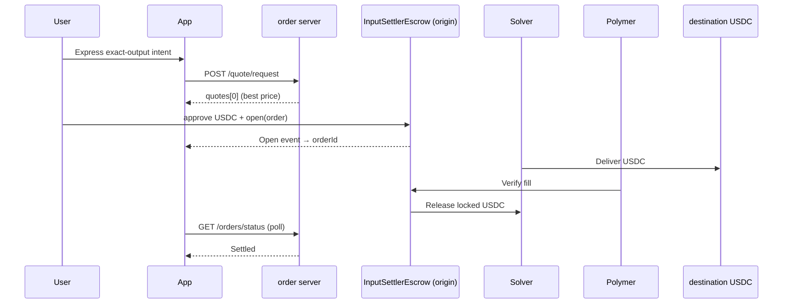

# One-Click Treasury

**An interactive guide to LI.FI Intents — with a scripted /buy walkthrough (no wallet needed).**

Built for the [LI.FI Builders Intents Mini Challenge](https://docs.li.fi/lifi-intents/introduction).

This is not a generic swap UI. It is a **DevRel-style walkthrough** of the Open Intents Framework (OIF): four chapters on the landing page explain what intents are, how they differ from bridges, and how settlement works — then `/buy` plays a **controlled, replayable intent lifecycle** using the exact same shapes and terminology as the real LI.FI Intents flow.

**Use case narrative:** tokenized treasury on-ramps (USDY, OUSG, etc.). The demo settles to **USDC on Arbitrum (Sepolia in dev mode)** as the destination asset; the RWA leg is the same intent rails with KYC gated behind a KYB solver track.

---

## /buy walkthrough flow

```text
Landing (education)          /buy (scripted walkthrough)
─────────────────────        ─────────────────────────
Ch. 01 · What are Intents?   Compose → Quote → Review
System flow diagram          Execute → Settled (scripted)
Ch. 02 · Intents vs bridges  Intent Theater + event tape
Ch. 03 · Intent lifecycle    Deep-dive technical sheet
Ch. 04 · Builder pillars
```



**Scripted example:** **$10 USDC** exact-output, **Base Sepolia → Arbitrum Sepolia**.

> The `/buy` page deliberately makes **no wallet calls and no network calls** so newcomers can learn the intent mental model first. The collapsible Technical panel shows **representative payload shapes** matching the real API.

---

## What you'll learn

| Topic | Where |
| --- | --- |
| Intent vs bridge mental model | Landing · Ch. 02 comparison table |
| Order server + solver marketplace | Landing · Ch. 01 concept cards |
| Escrow settlement + oracle proof | Landing · system flow diagram |
| Exact-output quoting | `/buy` + `lib/intents.ts` |
| StandardOrder encoding (ethers) | `lib/intents.ts` → `buildStandardOrder()` |
| On-chain execution (wagmi/viem) | `components/buy-flow.tsx` |
| Order lifecycle states | Intent Theater · `Open → Signed → Delivered → Settled` |

---

## Stack

| Layer | Choice |
| --- | --- |
| Framework | Next.js 14 (App Router) + TypeScript |
| Styling | Tailwind CSS · Framer Motion |
| UI | shadcn/ui · lucide-react · sonner |
| Wallet | wagmi 2 · viem 2 · RainbowKit *(kept in repo for reference, not used on `/buy` walkthrough)* |
| Order encoding | ethers v6 (`AbiCoder` — 1:1 with LI.FI docs) |
| Intents API | LI.FI Intents order server shapes (`/quote/request`, `/orders/status`) — shown in Technical panel as representative examples |

---

## Quick start

### 1. Clone & install

```bash
cd one-click-treasury
npm install
```

From the parent `lifi/` folder you can also run `npm run dev` (see root `package.json`).

### 2. Environment

```bash
cp .env.example .env
```

```env
NEXT_PUBLIC_WALLETCONNECT_PROJECT_ID=your_project_id_here
NEXT_PUBLIC_INTENTS_ENV=dev
```

| Variable | Values | Default |
| --- | --- | --- |
| `NEXT_PUBLIC_WALLETCONNECT_PROJECT_ID` | Reown / WalletConnect project ID | optional |
| `NEXT_PUBLIC_INTENTS_ENV` | `dev` or `mainnet` | `dev` |

> The `/buy` walkthrough does not require a wallet. These variables are kept for reference and for future re-enabling of a live mode.

### 3. Run

```bash
npm run dev
```

Open [http://localhost:3000](http://localhost:3000).

| Page | URL |
| --- | --- |
| Architecture guide | `/` |
| Scripted intent walkthrough | `/buy` |

### 4. Production build

```bash
npm run build && npm start
```

### 5. (Optional) Smoke-test the quote API

```bash
npm run test:quote
```

Prints the configured route and whether the order server returns solver quotes. This script is **not used by the `/buy` walkthrough**.

---

## Using the `/buy` walkthrough (no wallet)

### Steps

1. Open `/buy`
2. You’ll see the $10 example pre-filled
3. Click **Play the flow ▶**
4. At Review, click **Confirm and continue** (default filming mode — auto-advance is off)
5. Watch the Intent Theater timeline + tape feed stream through settlement
6. Click **Replay ↺** to restart cleanly for another take

---

## Live mode (reference only)

This repository also contains real LI.FI Intents wiring (`lib/intents.ts`, contracts, token IDs, etc.) from earlier iterations. The current `/buy` page intentionally does **not** execute live transactions.

---

## Project structure

```text
one-click-treasury/
├── app/
│   ├── page.tsx              # Landing — 4-chapter guide
│   ├── buy/page.tsx          # Live lab shell
│   ├── layout.tsx            # Metadata + providers
│   └── opengraph-image.tsx   # Social preview card
├── components/
│   ├── intents-primer.tsx    # Ch. 01 — core concepts
│   ├── intent-vs-bridge.tsx  # Ch. 02 — comparison
│   ├── how-it-works.tsx      # Ch. 03 — lifecycle
│   ├── what-this-unlocks.tsx # Ch. 04 — builder pillars
│   ├── intent-theater.tsx    # Timeline + event tape
│   ├── education-sheet.tsx   # Post-demo deep dive
│   └── buy-flow.tsx          # State machine + scripted walkthrough playback
├── lib/
│   ├── intents-config.ts     # dev / mainnet constants (chains, tokens, contracts)
│   ├── intents.ts            # Quote, encode, poll — integrator surface
│   ├── wagmi.ts              # Chain list + origin/dest chain exports
│   ├── explorer.ts           # Block explorer URLs per environment
│   ├── abis.ts               # ERC20 + InputSettlerEscrow
│   └── types.ts              # Quote + flow types
├── scripts/
│   └── test-quote.mjs        # CLI quote smoke test
└── CHANGELOG.md              # API notes + verified run logs
```

### Key integrator entry points

```typescript
// lib/intents.ts
requestQuote({ userAddress, outputAmount })   // POST {orderServer}/quote/request
buildStandardOrder({ userAddress, inputAmount, outputAmount })  // ethers AbiCoder
pollOrderStatus(orderId, onUpdate)            // GET {orderServer}/orders/status
```

Exact-output request shape (simplified):

```json
{
  "intent": {
    "intentType": "oif-swap",
    "swapType": "exact-output",
    "inputs": [{ "asset": "…USDC_BASE", "amount": null }],
    "outputs": [{ "asset": "…USDC_ARBITRUM", "amount": "10000000" }]
  },
  "supportedTypes": ["oif-escrow-v0"]
}
```

Full reference: [LI.FI Intents quickstart](https://docs.li.fi/lifi-intents/quickstart).

---

## Deploy to Vercel

1. Push to GitHub
2. Import project in [Vercel](https://vercel.com)
3. Set root directory to `one-click-treasury` (if monorepo-style layout)
4. Add environment variables:

   | Name | Value |
   | --- | --- |
   | `NEXT_PUBLIC_WALLETCONNECT_PROJECT_ID` | Your Reown / WalletConnect project ID |
   | `NEXT_PUBLIC_INTENTS_ENV` | `dev` or `mainnet` |

5. Deploy

Optional: set `NEXT_PUBLIC_SITE_URL` to your production URL for correct OG metadata.

---

## Troubleshooting

| Issue | Fix |
| --- | --- |
| `ChunkLoadError` / blank page | Delete `.next`, restart `npm run dev`, hard refresh (`Ctrl+Shift+R`) |
| Port 3000 in use | Kill stale Node process or use the port Next.js picks (e.g. 3001) |
| `npm run dev` fails from parent folder | `cd one-click-treasury` or use root `npm run dev` |
| Playback pacing too fast/slow | Tune `TIMING` and `AUTO_ADVANCE_REVIEW` in `components/buy-flow.tsx` |
| Need multiple clean takes | Use **Replay ↺** on the Done screen |

---

## Resources

- [LI.FI Intents introduction](https://docs.li.fi/lifi-intents/introduction)
- [Escrow quickstart](https://docs.li.fi/lifi-intents/quickstart)
- [API overview](https://docs.li.fi/lifi-intents/intents-api/api-overview)
- Order servers: `https://order-dev.li.fi` (testnet) · `https://order.li.fi` (mainnet)
- Walkthrough video: **TODO** — add before submission
- Source repo: **TODO** — add GitHub URL before submission

---

## Disclaimer

The `/buy` page is a **concept walkthrough** and does **not** execute live transactions. The technical disclosure shows **representative payload shapes** matching the real LI.FI Intents API. Swapping USDC → USDY/OUSG uses the same intent architecture but is not included here due to RWA KYC requirements.
