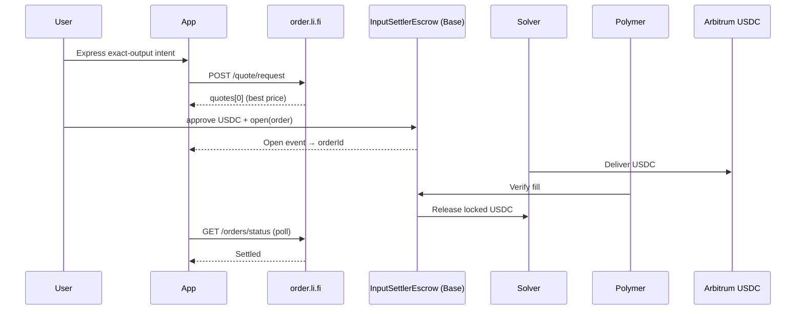

# One-Click Treasury

**An interactive guide to LI.FI Intents — with a live mainnet lab.**

Built for the [LI.FI Builders Intents Mini Challenge](https://docs.li.fi/lifi-intents/introduction).

This is not a generic swap UI. It is a **DevRel-style walkthrough** of the Open Intents Framework (OIF): four chapters on the landing page explain what intents are, how they differ from bridges, and how settlement works — then `/buy` lets you execute a **real exact-output intent** on mainnet.

**Use case narrative:** tokenized treasury on-ramps (USDY, OUSG, etc.). The demo settles to **USDC on Arbitrum** as the destination asset; the RWA leg is the same intent rails with KYC gated behind a KYB solver track.

---

## Live demo flow

```text
Landing (education)          /buy (interactive lab)
─────────────────────        ─────────────────────────
Ch. 01 · What are Intents?   Compose → Quote → Review
System flow diagram          Approve → Open → Poll → Settled
Ch. 02 · Intents vs bridges  Intent Theater + event tape
Ch. 03 · Intent lifecycle    Deep-dive technical sheet
Ch. 04 · Builder pillars
```



**Hardcoded route for this demo:** Base USDC → Arbitrum USDC (`swapType: exact-output`).

---

## What you'll learn

| Topic | Where |
| --- | --- |
| Intent vs bridge mental model | Landing · Ch. 02 comparison table |
| Order server + solver marketplace | Landing · Ch. 01 concept cards |
| Escrow settlement + oracle proof | Landing · system flow diagram |
| Exact-output quoting | `/buy` + `lib/intents.ts` |
| StandardOrder encoding (ethers) | `lib/intents.ts` → `buildStandardOrder()` |
| On-chain execution (wagmi/viem) | `components/buy-flow.tsx` |
| Order lifecycle states | Intent Theater · `Open → Signed → Delivered → Settled` |

---

## Stack

| Layer | Choice |
| --- | --- |
| Framework | Next.js 14 (App Router) + TypeScript |
| Styling | Tailwind CSS · Framer Motion |
| UI | shadcn/ui · lucide-react · sonner |
| Wallet | wagmi 2 · viem 2 · RainbowKit |
| Order encoding | ethers v6 (`AbiCoder` — 1:1 with LI.FI docs) |
| Intents API | `https://order.li.fi` — **no API key, no rate limit** |

---

## Quick start

### 1. Clone & install

```bash
cd one-click-treasury
npm install
```

From the parent `lifi/` folder you can also run `npm run dev` (see root `package.json`).

### 2. Environment

```bash
cp .env.example .env
```

Add your WalletConnect project ID ([cloud.reown.com](https://cloud.reown.com) — free, ~2 min):

```env
NEXT_PUBLIC_WALLETCONNECT_PROJECT_ID=your_project_id_here
```

> **Security:** `.env` is gitignored. Never commit it. `NEXT_PUBLIC_*` vars are exposed to the browser — that is expected for WalletConnect, but still keep the file local.

### 3. Run

```bash
npm run dev
```

Open [http://localhost:3000](http://localhost:3000).

| Page | URL |
| --- | --- |
| Architecture guide | `/` |
| Live intent lab | `/buy` |

### 4. Production build

```bash
npm run build && npm start
```

---

## Running the live intent (mainnet)

**Mainnet only. Real funds.**

| Asset | Chain | Amount |
| --- | --- | --- |
| USDC | Base | ~$15 (e.g. $10 intent + solver spread) |
| ETH | Base | ~$1 for gas (approve + `open`) |

### Steps

1. Connect wallet (RainbowKit) — requires `NEXT_PUBLIC_WALLETCONNECT_PROJECT_ID`
2. Switch to **Base mainnet**
3. Go to `/buy` → enter amount → **Get quote**
4. **Confirm and pay** → approve USDC → open escrow → watch Intent Theater
5. Wait for status **Settled** → Basescan link for the open tx

### Fund Base (if needed)

1. Bridge ETH → [bridge.base.org](https://bridge.base.org)
2. Swap to USDC on Base (Uniswap, LI.FI, or CEX withdrawal to Base)
3. Keep a small ETH balance for gas

### Without mainnet funds

You can still use the **landing guide** and walk `/buy` until quote/review. Approve and open require USDC + ETH on Base.

---

## Project structure

```text
one-click-treasury/
├── app/
│   ├── page.tsx              # Landing — 4-chapter guide
│   ├── buy/page.tsx          # Live lab shell
│   ├── layout.tsx            # Metadata + providers
│   └── opengraph-image.tsx   # Social preview card
├── components/
│   ├── intents-primer.tsx    # Ch. 01 — core concepts
│   ├── intent-vs-bridge.tsx  # Ch. 02 — comparison
│   ├── how-it-works.tsx      # Ch. 03 — lifecycle
│   ├── what-this-unlocks.tsx # Ch. 04 — builder pillars
│   ├── intent-theater.tsx    # Timeline + event tape
│   ├── education-sheet.tsx   # Post-demo deep dive
│   └── buy-flow.tsx          # State machine + on-chain orchestration
├── lib/
│   ├── intents.ts            # Quote, encode, poll — integrator surface
│   ├── abis.ts               # ERC20 + InputSettlerEscrow
│   └── types.ts              # Quote + flow types
└── CHANGELOG.md              # API notes + verified mainnet tx
```

### Key integrator entry points

```typescript
// lib/intents.ts
requestQuote({ userAddress, outputAmount })   // POST order.li.fi/quote/request
buildStandardOrder({ userAddress, inputAmount, outputAmount })  // ethers AbiCoder
pollOrderStatus(orderId, onUpdate)            // GET order.li.fi/orders/status
```

Exact-output request shape (simplified):

```json
{
  "intent": {
    "intentType": "oif-swap",
    "swapType": "exact-output",
    "inputs": [{ "asset": "…USDC_BASE", "amount": null }],
    "outputs": [{ "asset": "…USDC_ARBITRUM", "amount": "10000000" }]
  },
  "supportedTypes": ["oif-escrow-v0"]
}
```

Full reference: [LI.FI Intents quickstart](https://docs.li.fi/lifi-intents/quickstart).

---

## Deploy to Vercel

1. Push to GitHub
2. Import project in [Vercel](https://vercel.com)
3. Set root directory to `one-click-treasury` (if monorepo-style layout)
4. Add environment variable:

   | Name | Value |
   | --- | --- |
   | `NEXT_PUBLIC_WALLETCONNECT_PROJECT_ID` | Your Reown / WalletConnect project ID |

5. Deploy

Optional: set `NEXT_PUBLIC_SITE_URL` to your production URL for correct OG metadata.

---

## Troubleshooting

| Issue | Fix |
| --- | --- |
| Connect button does nothing | Add `NEXT_PUBLIC_WALLETCONNECT_PROJECT_ID` to `.env`, restart dev server |
| `ChunkLoadError` / blank page | Delete `.next`, restart `npm run dev`, hard refresh (`Ctrl+Shift+R`) |
| Port 3000 in use | Kill stale Node process or use the port Next.js picks (e.g. 3001) |
| `npm run dev` fails from parent folder | `cd one-click-treasury` or use root `npm run dev` |
| Quote fails | Wallet on Base mainnet; amount > 0; check network tab for `order.li.fi` |
| Tx rejected | User cancelled — no funds moved; retry from review |
| Order **Expired** | Refund available on InputSettlerEscrow — see [docs](https://docs.li.fi/lifi-intents/quickstart) |

---

## Resources

- [LI.FI Intents introduction](https://docs.li.fi/lifi-intents/introduction)
- [Escrow quickstart](https://docs.li.fi/lifi-intents/quickstart)
- [API overview](https://docs.li.fi/lifi-intents/intents-api/api-overview)
- Order server: `https://order.li.fi`
- Walkthrough video: **TODO** — add before submission
- Source repo: **TODO** — add GitHub URL before submission

---

## Disclaimer

This project executes **real mainnet transactions**. The demo uses exact-output USDC settlement on Arbitrum as a treasury on-ramp illustration. Swapping USDC → USDY/OUSG uses the same intent architecture but is not included here due to RWA KYC requirements.
